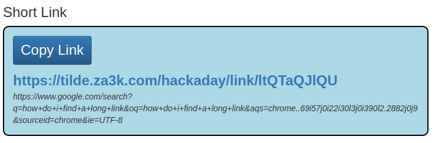

Hack-A-Day is a project I'm doing in November, where I try to make 30 new projects, in 30 days.

# Day 02: Hack-A-Link

This is a link shortener. Paste a link, and get a shorter one to share on the web.

Demo available at [here](https://tilde.za3k.com/hackaday/link).

Source available on [github](https://github.com/za3k/day02_link.
